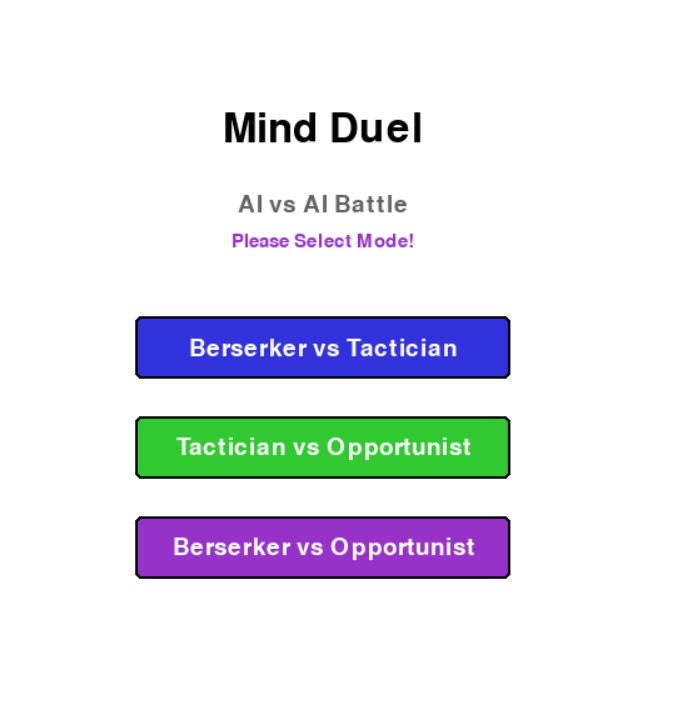

# Ai-game---MInd-Duel-

# Mind Duel 🎮

A strategic AI vs AI battle game featuring **Fuzzy Logic** and **A\* Pathfinding** algorithms. Watch intelligent agents with unique personalities compete in turn-based combat!


## 🎯 Game Overview

Mind Duel is a tactical grid-based combat simulator where two AI agents battle for supremacy on a 5×5 board. Each AI has a distinct personality type that influences decision-making through fuzzy logic reasoning, while A* pathfinding ensures optimal movement strategies.

## 🎮 Game Rules

### Victory Conditions
Players can win through three different paths:
- **Energy Victory**: Collect 12 energy points
- **Knockout Victory**: Reduce opponent's health to 0
- **Points Victory**: Have higher total (health + energy) after 30 turns
- **Draw**: Equal total points after 30 turns

### Game Mechanics

#### Player Stats
- **Health**: 4 HP (starting value)
- **Energy**: 0 (starting value, max unlimited)

#### Action Types
1. **Move**: Move one cell in any cardinal direction (up, down, left, right)
2. **Attack**: Deal 1 damage to adjacent opponent
3. **Teleport**: Jump to any unoccupied cell (costs 4 energy)

#### Orb System
- **Energy Orbs** (Yellow): Grant +2 energy
- **Power Orbs** (Purple/Yellow): Grant +4 energy
- Initial spawn: 3 random orbs
- New orb spawns after collection
- 70% chance Energy Orb, 30% chance Power Orb

### Turn Structure
- Players alternate turns
- One action per turn (move/attack/teleport)
- Automatic orb collection upon landing
- Maximum 30 turns per game

## 🤖 AI Personalities

### 1. Berserker 🔥
**"Attack first, think later"**
- **Playstyle**: Hyper-aggressive, rushes into combat
- **Strengths**: 
  - 1.5× aggression multiplier in fuzzy logic
  - Prioritizes attacks (+8 score bonus)
  - Kamikaze mode: Even at low health, stays aggressive
- **Weaknesses**: Poor resource management, vulnerable when low HP
- **Best Against**: Tactician (overwhelms careful planning)

### 2. Tactician 🧠
**"Calculated precision wins wars"**
- **Playstyle**: Balanced, strategic resource management
- **Strengths**:
  - 1.3× neutral behavior multiplier
  - Prioritizes Power Orbs (+7 score)
  - Executes calculated kills on low-HP opponents (+10 score)
- **Weaknesses**: Can be too cautious, may lose tempo
- **Best Against**: Opportunist (denies optimal positions)

### 3. Opportunist 💎
**"Strike when the iron is hot"**
- **Playstyle**: Resource-focused, adapts to advantages
- **Strengths**:
  - Heavily prioritizes Power Orbs (+12 score)
  - Energy advantage exploitation (+6 attack score)
  - 1.2× aggression when energy is high
- **Weaknesses**: Passive when behind, can be bullied
- **Best Against**: Berserker (exploits reckless moves)

## 🧮 AI Implementation

### Fuzzy Logic System

The game uses a sophisticated fuzzy inference system to determine AI behavior:

#### Fuzzification
Variables are converted to fuzzy sets using membership functions:

**Health Fuzzy Sets** (0-4 HP):
- `critical`: Trapezoidal [0, 0, 1, 1.5]
- `low`: Triangular [1, 2, 3]
- `good`: Trapezoidal [2.5, 3, 4, 4]

**Energy Fuzzy Sets** (0-12+ energy):
- `low`: Trapezoidal [0, 0, 2, 4]
- `medium`: Triangular [3, 6, 9]
- `high`: Trapezoidal [8, 10, 15, 15]

**Distance Fuzzy Sets** (0-8 cells):
- `very_close`: Trapezoidal [0, 0, 1, 2]
- `close`: Triangular [1, 2.5, 4]
- `far`: Trapezoidal [3, 5, 8, 8]

**Turn Progress** (normalized 0-1):
- `early`: Trapezoidal [0, 0, 0.3, 0.5]
- `mid`: Triangular [0.3, 0.5, 0.7]
- `late`: Trapezoidal [0.6, 0.8, 1, 1]

#### Fuzzy Rules
The system applies 6+ core rules:
1. **Critical Health → Defensive**: IF health is critical THEN be defensive
2. **Good Health + Low Enemy → Aggressive**: IF health is good AND opponent health is low THEN be aggressive
3. **Close Distance + Good Health → Aggressive**: IF distance is very close AND health is good THEN be aggressive
4. **High Energy + Late Game → Aggressive**: IF energy is high AND turn is late THEN be aggressive
5. **Low Health + Close Distance → Defensive**: IF health is low AND distance is very close THEN be defensive
6. **Normal Situation → Neutral**: IF health is good AND energy is medium THEN be neutral

#### Defuzzification
Uses **centroid method** to convert fuzzy aggression output to crisp value (0-1):
- 0-0.3: Defensive behavior
- 0.3-0.7: Neutral behavior
- 0.7-1.0: Aggressive behavior

### A\* Pathfinding

Implements optimal pathfinding for strategic movement:

**Algorithm Features**:
- **Heuristic**: Manhattan distance (|x1-x2| + |y1-y2|)
- **Cost Function**: g(n) = actual distance, h(n) = Manhattan distance
- **f(n) = g(n) + h(n)**: Total path cost
- **Priority Queue**: Efficient node exploration using heapq
- **Obstacle Avoidance**: Treats opponent position as blocked

**Applications**:
1. **Orb Navigation**: Finds shortest path to nearest valuable orb
2. **Tactical Positioning**: Evaluates move quality based on resulting path length
3. **Resource Prioritization**: Weights paths by orb type (Power > Energy)

### Action Evaluation Algorithm

```python
score = base_score + fuzzy_modifier + astar_modifier + personality_modifier + random_noise
```

**Scoring Components**:
- **Base Score**: Orb collection (10 for Power, 5 for Energy)
- **Fuzzy Modifier**: Aggression-based attack/defense scoring
- **A* Modifier**: Path efficiency (8 / path_length to nearest orb)
- **Personality Modifier**: Unique bonuses per AI type
- **Random Noise**: ±0.5 for unpredictability

## 🎨 User Interface

### Main Menu

- Three matchup options:
  - Berserker vs Tacticians
  - Tactician vs Opportunist
  - Berserker vs Opportunist

### Game Screen
.png)

**Left Panel - Game Board**:
- 5×5 grid with visual cell borders
- Player indicators with health bars
- Animated movement trails
- Directional arrows showing last move
- Color-coded orbs (Yellow/Purple-Yellow)

**Right Panel - Information Display**:
- Current turn counter (X/30)
- Active player indicator
- Player 1 stats (Name, Personality, Health, Energy)
- Player 2 stats (Name, Personality, Health, Energy)
- Real-time game log (last 8 events)

**Bottom Controls**:
- **Pause**: Pause/resume game
- **< Back**: View previous turn state
- **Forward >**: View next turn state (during replay)
- **Restart**: Return to main menu

### Visual Features
- **Smooth Animations**: 60 FPS movement interpolation
- **Movement Trails**: Dotted trail showing player path
- **Directional Arrows**: Visual indicator of movement direction
- **Health Bars**: Real-time health display above players
- **Turn History**: Full game replay with backward/forward navigation

## 🛠️ Technical Details

### Technologies
- **Language**: Python 3.x
- **Framework**: Pygame 2.x
- **Architecture**: Object-Oriented Design

### Key Classes

#### `FuzzyLogic`
- Membership function implementations (triangular, trapezoidal)
- Fuzzification methods for game variables
- Rule-based inference engine
- Centroid defuzzification

#### `AStarPathfinder`
- Priority queue-based A* implementation
- Manhattan distance heuristic
- Optimal orb targeting with obstacle avoidance
- Path cost calculation with orb value weighting

#### `MindDuelGame`
- Main game loop and state management
- Turn-based action processing
- History system for replay functionality
- UI rendering and event handling

#### `Player`
- Position tracking (current + previous for animation)
- Health and energy management
- Personality assignment
- Animation progress interpolation

### Performance Optimizations
- Efficient heapq for A* priority queue
- Shallow copy for state history (copy.deepcopy)
- 60 FPS cap with clock synchronization
- Limited game log size (15 entries max)

## 🚀 Installation & Usage

### Prerequisites
```bash
pip install pygame
```

### Running the Game
```bash
python mind_duel.py
```

### Controls
- **Mouse Click**: Select menu options, click buttons
- **Space / ESC**: Pause/unpause game
- **Left Arrow**: View previous turn
- **Right Arrow**: View next turn (during replay)

## 📊 Game Statistics

### Constants
| Parameter | Value | Description |
|-----------|-------|-------------|
| `BOARD_SIZE` | 5 | Grid dimensions (5×5) |
| `MAX_TURNS` | 30 | Maximum game length |
| `WIN_ENERGY` | 12 | Energy victory threshold |
| `STARTING_HEALTH` | 4 | Initial HP |
| `STARTING_ENERGY` | 0 | Initial energy |
| `TELEPORT_COST` | 4 | Energy cost for teleport |
| `ENERGY_ORB_VALUE` | 2 | Energy from yellow orbs |
| `POWER_ORB_VALUE` | 4 | Energy from purple orbs |

## 🎓 Educational Value

This project demonstrates:
1. **Fuzzy Logic**: Real-world application of fuzzy inference systems
2. **A\* Algorithm**: Optimal pathfinding implementation
3. **Game AI**: Personality-based decision making
4. **State Management**: History system with replay functionality
5. **Animation**: Smooth interpolation and visual feedback
6. **OOP Design**: Clean class structure and separation of concerns

## 📝 License

This project is open source and available for educational purposes.

## 👨‍💻 Author
Tasfia Zaman Samiha  
Farzana Rahman Ani


---

**Enjoy watching the AIs battle! May the smartest algorithm win! 🏆**
